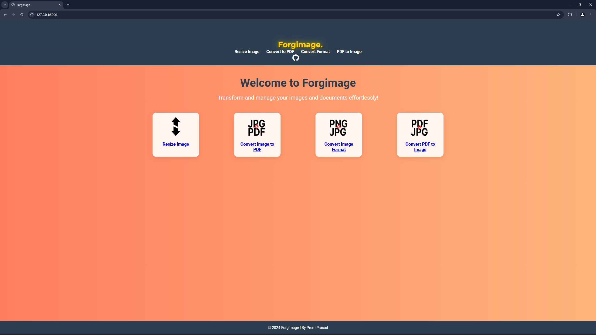

# Forgimage - Image and PDF Conversion Web App

This web application allows users to:
1. Convert images from one format to another.
2. Resize images to custom dimensions.
3. Convert images into PDF documents.
4. Convert PDF documents into images.

Built using **Python**, **Flask**, **HTML**, **CSS**, and **JavaScript**, this app provides an intuitive and simple user interface to handle common image and PDF conversion tasks.

## Features

- **Image Format Conversion**: Convert images between various formats (JPEG, PNG, GIF, etc.).
- **Image Resizing**: Resize images by specifying custom width and height.
- **Image to PDF Conversion**: Convert one or more images into a single PDF file.
- **PDF to Image Conversion**: Convert each page of a PDF document into an image format.

## Screenshots

### 1. Home Page

### 2. Resizing Images

### 3. IMAGE to PDF Conversion

### 4. IMAGE format Conversion

### 3. PDF to IMAGE Conversion

